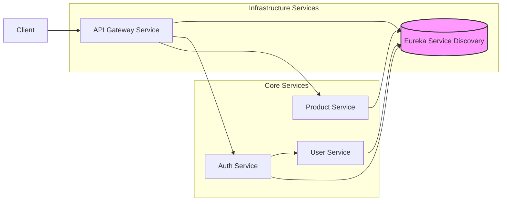

# E-Commerce Backend Microservices & Logging Pipeline

This repository provides an overview and entry point for a comprehensive E-Commerce backend system built using a microservices architecture with Spring Boot, alongside a robust, scalable logging pipeline.

**Developed By:** Ankit Kumar Baiskhiyar ([LinkedIn](https://www.linkedin.com/in/baiskhiyar/))

---

## 1. E-Commerce Backend Microservices

This project implements a scalable and resilient backend for an E-Commerce platform using independently deployable microservices managed by Spring Cloud components.

### Architecture Overview

The system follows a standard microservice pattern:

1.  **Client Requests:** All incoming requests first hit the **API Gateway**.
2.  **Service Discovery:** The API Gateway uses the **Eureka Service** to discover the network locations of other downstream services.
3.  **Authentication & Authorization:** The Gateway routes requests needing authentication to the **Auth Service**. The Auth Service validates JWT tokens and interacts with the **User Service** if necessary to fetch user details.
4.  **Business Logic:** Once authenticated/authorized, requests are forwarded to the appropriate business logic service (**Product Service**, Order Service, Payment Service, etc. - *Note: Order/Payment services are conceptual parts of a full system but specific repos are not included here*).
5.  **Data Persistence:** Each service manages its own data (e.g., MySQL, PostgreSQL). Caching (e.g., Redis) can be implemented at various levels for performance.



## Microservice Repositories
Here are the individual repositories for each microservice component:

1. **[Eureka Discovery Service](https://github.com/baiskhiyar/SpringBoot-EurekaService) :** SpringBoot-EurekaService: Handles service registration and discovery, allowing services to find each other dynamically. Built with Spring Cloud Netflix Eureka.
2. **[API Gateway Service](https://github.com/baiskhiyar/SpringBoot-ApiGatewayService) :** SpringBoot-ApiGatewayService: Single entry point for all client requests. Handles routing, load balancing (basic), security enforcement (via Auth Service), and request aggregation. Built with Spring Cloud Gateway.
3. **[Authentication Service](https://github.com/baiskhiyar/SpringBoot-AuthService) :** SpringBoot-AuthService: Manages user authentication using JWT (JSON Web Tokens). Responsible for issuing, validating, and refreshing tokens. Interacts with the User Service for user data.
4. **[User Service](https://github.com/baiskhiyar/SpringBoot-UserService) :** SpringBoot-UserService: Manages user profiles, registration, and related data persistence.
5. **[Product Service](https://github.com/baiskhiyar/SpringBoot-ProductService) :** SpringBoot-ProductService: Manages product catalog information, inventory levels, pricing, etc.
6. **[Ordering Service]() :** SpringBoot-OrderingService: Responsible for managaing cart and ordering flow.
7. **[Payments Service]() :** SpringBoot-PaymentService: Responsible for managing payments.

## Key Technologies (E-Commerce)
1. **Framework:** Spring Boot, Spring Cloud (Eureka, Gateway)
2. **Authentication:** Spring Security, JWT
3. **Data Persistence:** JPA/Hibernate, MySQL
4. **Caching:** Redis
5. **Build Tool**: Maven
6. **Language:** Java

## 2. Centralized Logging Pipeline
To effectively monitor the distributed microservices system, a dedicated logging pipeline was implemented to centralize, process, and visualize logs in real-time.

### Architecture Overview
1. **Log Generation:** Each Spring Boot microservice uses Logback to generate structured logs.
2. **Log Shipping:** Logs are pushed asynchronously from each service to a central Kafka topic. This decouples logging from the service's core functionality and handles backpressure.
3. **Log Aggregation/Processing:** FluentD acts as a Kafka consumer, pulling logs from the topic. It can parse, filter, and transform logs before forwarding them.
4. **Log Storage & Indexing:** FluentD pushes the processed logs to Elasticsearch, which stores and indexes them efficiently for searching.
5. **Log Visualization & Analysis:** Grafana connects to Elasticsearch as a data source, providing dashboards for visualizing log data, searching logs, and creating alerts.
6. **Orchestration:** The entire logging stack (Kafka, Zookeeper, FluentD, Elasticsearch, Grafana) is managed and deployed using Docker Compose for ease of setup and scalability.

```mermaid
    graph LR
    subgraph Microservices
        ServiceA[Service A];
        ServiceB[Service B];
        ServiceC[Service C];
    end

    Logback{Logback} --> Kafka[Kafka Topic];
    ServiceA -- generates logs --> Logback;
    ServiceB -- generates logs --> Logback;
    ServiceC -- generates logs --> Logback;

    Kafka --> FluentD[FluentD Consumer];
    FluentD --> Elasticsearch[Elasticsearch];
    Elasticsearch --> Grafana[Grafana Dashboard];

    subgraph Logging Infrastructure (Dockerized)
        Zookeper;
        Kafka;
        FluentD;
        Elasticsearch;
        Grafana;
    end
```

### Repository

*   **[Logging-Pipeline](https://github.com/baiskhiyar/Logging-Pipeline)**: Contains the Docker Compose configuration and necessary setup files for the entire logging stack (Kafka, Zookeeper, FluentD, Elasticsearch, Grafana), along with example Spring Boot configurations for shipping logs.

### Key Technologies (Logging)

*   **Log Framework:** Logback
*   **Message Broker:** Apache Kafka
*   **Log Collector/Forwarder:** FluentD
*   **Search & Analytics Engine:** Elasticsearch
*   **Visualization:** Grafana
*   **Containerization:** Docker, Docker Compose

---

## How to Run (High-Level)

*   **Prerequisites:** Docker, Docker Compose, Java JDK (e.g., 17+), Maven.
*   **Logging Pipeline:** Typically run first using `docker-compose up -d` within the `Logging-Pipeline` repository directory.
*   **Microservices:** Each microservice can generally be run as a standard Spring Boot application (e.g., `mvn spring-boot:run` or by building a JAR and running `java -jar ...`). Ensure the Eureka server is running before starting other services. Configuration (e.g., Kafka broker address, Eureka address) might need adjustment based on your local setup.

*Refer to the individual repositories for more specific build and run instructions.*

---

## Key Project Highlights

*   **Scalable Architecture:** Designed with microservices for independent scaling and development.
*   **Resilience:** Service discovery (Eureka) allows services to adapt to failures.
*   **Decoupled Components:** Loose coupling between services promotes maintainability.
*   **Centralized Logging:** Provides a unified view of logs across all services for easier debugging and monitoring.
*   **Real-time Monitoring:** Kafka + EFK stack enables near real-time log analysis.
*   **Industry Standard Technologies:** Utilizes widely adopted tools like Spring Boot, Kafka, Elasticsearch, Docker.
*   **Secure:** Implements JWT-based authentication and authorization.

---
